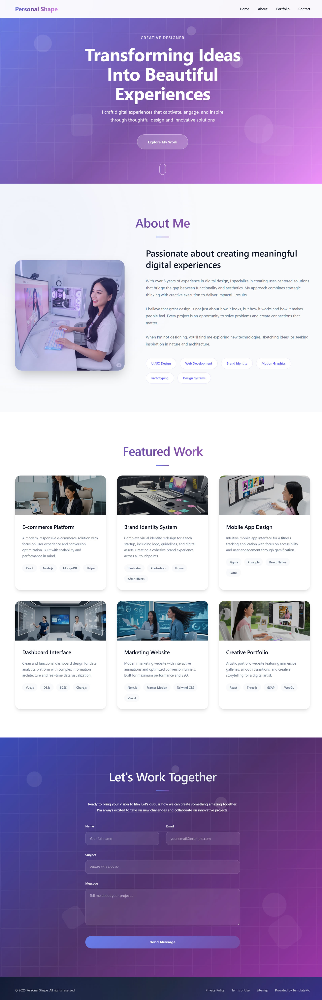

# Personal Shape App

This project is made with learning and understanding purpose of React props.I'm here using this just give and take game with props. It doesn't have functionality, it's a design .. when i know more about functionality with React, I will add these things with state In Sha Allah. And lastly, this is not responsive for every devices because i don't focus on styling.

## Technology And Library Usage:

- React
- TailwindCSS
- Daisy UI
- Swiper.js
- Vite

## Installation & Setup:

### Clone the repo

git clone https://github.com/your-username/personal-shape-app.git

#### Navigate into the project

cd portfolio-app

#### Install dependencies

npm install

#### Start development server

npm run dev

## ScreenShots

;

## Future Improvements

- Make it fully responsive

- Add dark mode

- Add animations with Framer Motion

- Improve accessibility

## Contributing

Contributions, issues, and feature requests are welcome!
Feel free to open a PR or issue.

## License

This project is licensed under the MIT License – feel free to use it!

## Author

Md Pial
